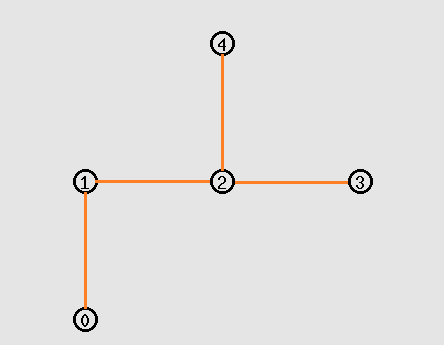

### 说明

* aodv-uu-0.9.6是主要改写的文件，功能是将节点稳定性参数加入到hello包中；节点收到hello包会创建一个hello_ack包回复；

* cmu-trace.cc文件只进行了如下修改，增加了：

  ```c
  	case AODV_HELLO_ACK:

  		/* NO PRINT */
  ```

  这样在trace时能够正确处理hello_ack类型的包；

* test.tcl是仿真时使用的tcl脚本，具体的拓扑环境为：




* ns-default.tcl需要替换掉原来的tcl/lib/下的同名文件，否则hello消息无法发送。


如有问题请联系：

email: guannanwang@foxmail.com